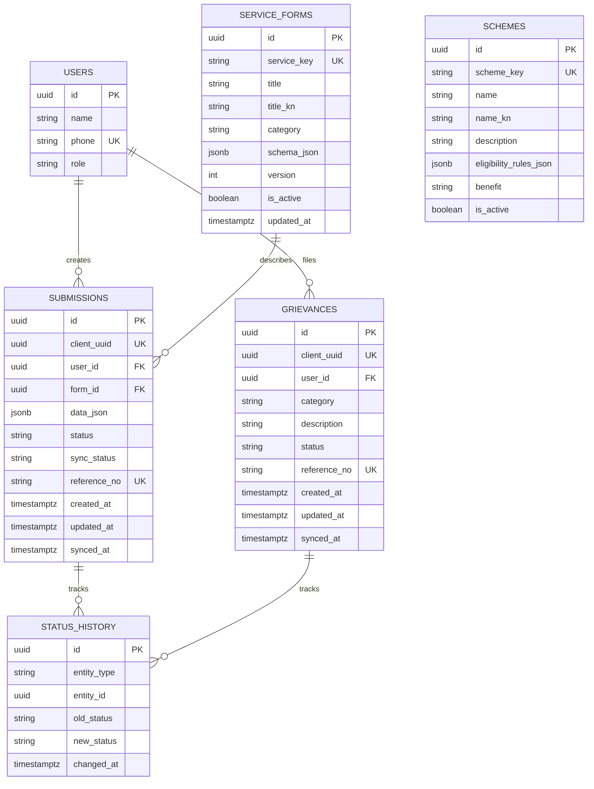

# Database

PostgreSQL 16 is the default persistence layer. Startup applies sorted SQL files from `server/src/migrations` exactly once, recording each filename in `schema_migrations`. Each migration runs in its own transaction. Startup then executes idempotent seeds.

Run `npm run db:migrate`, `npm run db:seed`, or, for a development database only, `NODE_ENV=development npm run db:reset` from `server/`. Tests and explicit `USE_MOCK_DB=true` may use the in-memory adapter. Normal development and production require PostgreSQL.

Submission and grievance sync use `client_uuid` as the idempotency key. Duplicate sync updates `synced_at` and returns the existing row, while the original content remains authoritative. Status transitions can be recorded in `status_history`.
